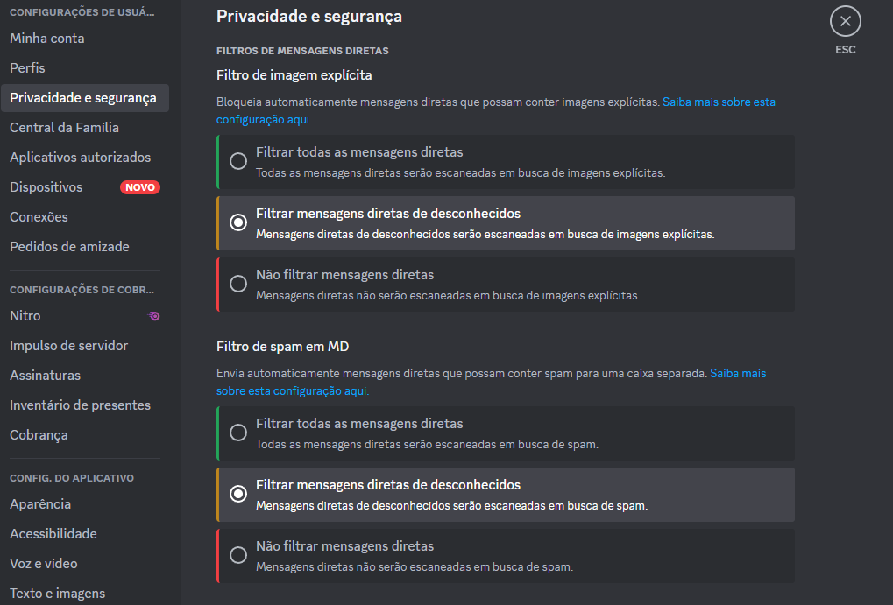

# 10 Heurísticas

## 1 - Visibilidade do status do sistema

O design de um sistema deve sempre manter o usuário informado sobre o que está acontecendo. Interações previsíveis gera mais confiança entre o cliente e o produto.

Exemplo: Vídeos do Youtube: Há uma barra de progresso atual do vídeo além de uma interface que deixa claro o que cada opção faz.

## 2 - Compatibilidade entre o sistema e o mundo real

A interface deve sempre visar falar a mesma língua do usuário, utilizando frases e conceitos familiares ao invés de termos internos.

Exemplo: Nas configurações de Privacidade e Segurança do Discord, o sistema usa o termo “Mensagem Direta” e abrevia-o como “MD”. Tanto o termo quanto a abreviação podem gerar uma certa confusão temporária para usuários brasileiros, visto que os mesmos estão mais acostumados a usar “Mensagem Privada” e “PV”.

## 3 - Liberdade e Controle de Usuário

Sistemas devem ter uma espécie de “saída de emergência” para sair/desfazer qualquer ação que o usuário possa ter feito por engano.

Exemplos: Aplicativos de navegadores para celular como o Google Chrome por exemplo, permitem que o usuário recrie uma aba que ele acabou de fechar rapidamente, com o apertar de um botão.

## 4 - Padrões e consistência

Sistemas devem sempre tentar seguir as mesmas convenções entre suas diferentes funcionalidade ou seguir os padrões da indústria para atender às expectativas dos usuários.

Exemplos: Tanto no Discord quanto no Skype o atalho para editar uma mensagem que o usuário acabou de enviar consiste no mesmo comando (Tecla ↑ ).

Ao utilizar-se do Skype as ações para fechar uma imagem e fechar um gif por exemplo, encontram-se em lados opostos da tela.

## 5 - Prevenção de erros

Sistemas devem ser projetados para cuidadosamente impedir que erros aconteçam ou apresentar avisos de confirmação ou avisos que alertem o usuário.

## 9 - Ajudar usuários à reconhecer, diagnosticar se recuperar de erros

Mensagens de erro devem ser expressa em linguagem comum, destacando o problema e oferecendo uma sugestão de correção.

Exemplo para heurística 5 e 9: Ao pesquisar em aplicações como Google Chrome ou Youtube, caso o usuário digite algum termo incorreto o sistema já o alerta e realiza a pesquisa com o termo que acredita ser correto.

## 6 - Reconhecimento ao invés de memorização

Um sistema deve permitir os usuários a reconhecer informações do mesmo, ao invés de “força-los” a se lembrar; podendo oferecer ajudar/dicas ao invés de fornecer um tutorial longo por exemplo.

Exemplo: Aplicações como Discord possuem um comando que os diferentes atalhos que o usuário pode utilizar no momento

## 7 - Flexibilidade e eficiência de uso

Atalhos ,que devem ser escondidos de usuários novos, podem ser usados para acelerar/melhorar a experiência de um usuário mais experiente. Dessa forma, o sistema consegue atender os dois tipos de usuário.

## 10 - Ajuda e documentação

Ajuda e documentação deve ser fácil de se encontrar a ajudar o usuário a acessar certas funcionalidades. Oferecendo uma lista concisa e concreta.

Exemplo para heurística 7 e 10: Aplicativos de mensagens como Discord e Skype possuem vários atalhos no teclado para ajudar na navegação e ativar funções específicas do sistema. As aplicações nunca introduzem esses atalhos para usuários novos, apenas para quem acessar certas opções de configuração do sistema.

## 8 - Estética e design minimalista

Cada unidade extra de informação não deve competir com outras informações ou funcionalidades mais importantes visando sempre focar nos elementos mais importantes para o usuário.

Exemplo: A mensagem exibida quando o usuário baixa uma imagem de um post no aplicativo do Reddit impede o mesmo de acessar os comentários do post ou de usar funções como upvote.

